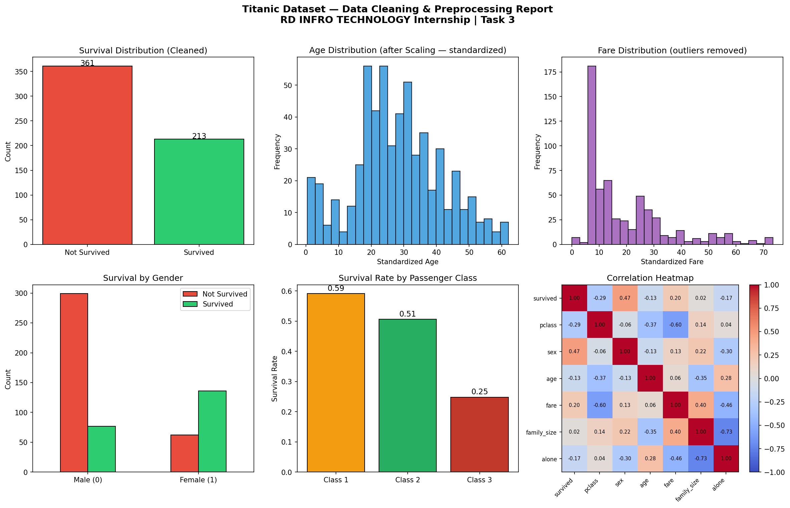

# RD INFRO TECHNOLOGY — Machine Learning Internship

## Task 3: Data Cleaning & Preprocessing

**Intern:** Shinjini  
**Organization:** RD Infro Technology  
**Domain:** Machine Learning  
**Dataset:** Titanic Survival Dataset (891 records, 15 features)

---

## Objective

Clean and preprocess raw data to make it suitable for machine learning model training. This includes handling missing values, removing outliers, encoding categorical variables, engineering new features, scaling, and splitting the data.

---

## Tools & Libraries

| Library | Purpose |
|---|---|
| `pandas` | Data loading, cleaning, manipulation |
| `numpy` | Numerical operations |
| `scikit-learn` | Encoding, scaling, train-test split |
| `seaborn` | Dataset loading, visualization |
| `matplotlib` | Plotting charts |

---

## Steps Performed

| Step | Description |
|---|---|
| 1 | Loaded dataset (891 rows × 15 columns) |
| 2 | Initial inspection — data types, missing values, statistics |
| 3 | Dropped redundant/duplicate columns and rows |
| 4 | Handled missing values — median for `age`/`fare`, mode for `embarked` |
| 5 | Removed outliers using IQR method on `age` and `fare` |
| 6 | Encoded categorical variables — binary for `sex`, one-hot for `embarked` |
| 7 | Feature engineering — created `family_size` and `age_group` |
| 8 | Applied `StandardScaler` on numeric columns |
| 9 | Train-test split — 80% train / 20% test (stratified) |
| 10 | Saved cleaned dataset as `titanic_cleaned.csv` |
| 11 | Generated visualization report |

---

## Results

| Metric | Value |
|---|---|
| Original shape | 891 rows × 15 columns |
| Final shape | 574 rows × 12 columns |
| Missing values remaining | 0 |
| Training samples | 459 |
| Testing samples | 115 |

---

## Files

```
RD-INFRO-TECHNOLOGY/
│
├── data_cleaning_preprocessing.py   # Main Python script
├── titanic_cleaned.csv              # Cleaned output dataset
├── preprocessing_report.png        # Visualization charts
└── README.md                       # Project documentation
```

---

## How to Run

```bash
# Install dependencies
pip install pandas scikit-learn seaborn matplotlib

# Run the script
python data_cleaning_preprocessing.py
```

---

## Visualization Preview


